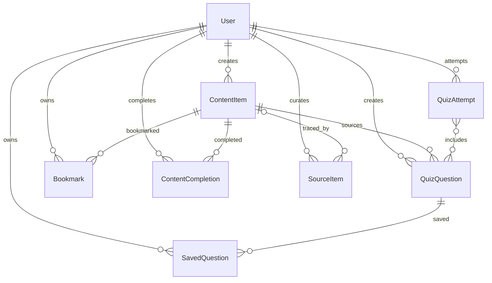
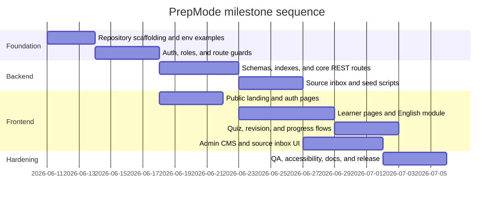

C:\Users\PRANAY\OneDrive\Documents\PrepMode\deep-research-report.md

# PrepMode Project Summary

## Executive summary

PrepMode is best defined as a focused exam-preparation web application for English, vocabulary, GK, current affairs, editorials, quizzes, revision, and measurable study progress across multiple exam contexts. The only concrete project artifact available in this session is a PrepMode landing-plan document, which positions the product around the messaging “English + GK. One Goal. Many Exams.” and “Focused Learning for Competitive Exams,” and scopes the public experience around exam modes, content pillars, dashboard previews, original reviewable learning content, and restrained marketing claims. fileciteturn0file0

Because no full code repository was available to inspect here, the remainder of this report is an implementation-ready contract rather than a claim about verified repository behavior. That contract is grounded in official documentation and standards: Express maps endpoints to HTTP methods and middleware; Mongoose schemas define document shape, references, validation, and timestamps; Vite exposes only `VITE_*` variables to the client through `import.meta.env`; bearer tokens belong in the `Authorization` header; JWT expiration must be enforced; and accessibility targets should align with WCAG 2.2’s testable success criteria. citeturn4view0turn4view1turn4view2turn11view0turn14view0turn15view0turn4view5turn10view0turn7view4turn7view5turn7view6

The recommended system boundary is strict: a static public landing layer, an authenticated learner workspace, and an admin-only CMS and source inbox. Content becomes learner-facing only after publication; answer keys are withheld until quiz submission and review; access control is deny-by-default and checked at each protected endpoint; client bundles never receive secrets; and study content is rendered without untrusted raw HTML. fileciteturn0file0 citeturn7view1turn7view0turn12view0turn4view5turn13view0

## Product overview and positioning

PrepMode should be treated as a serious exam-study workspace rather than a broad coaching marketplace. The available product artifact emphasizes a calm dashboard-style experience, exam-mode context switching, and original, reviewable learning material instead of subscriptions, community features, inflated analytics promises, or generic edtech hype. Its exam modes are `All`, `CAT`, `UPSC`, `SSC`, `Banking`, `CLAT`, `CUET`, `MBA`, and `Defence Exams`; these are not separate applications, but learner contexts that shape content retrieval, revision queues, and quiz selection. fileciteturn0file0

The primary user groups are threefold. Public visitors need a static marketing surface that explains scope, exam fit, and credibility. Registered learners need a protected study shell where they can browse content, attempt quizzes, save material, revisit saved questions, and see progress. Admins need a publishing and provenance shell where they can curate content, create questions, and manage a metadata-first source inbox. This separation is consistent with OWASP’s distinction between authentication and authorization: some resources may be public, but protected actions need explicit authorization logic at the endpoint level. citeturn6view0turn12view0

| Capability | Primary user | Expected outcome | Primary routes | Core data |
| --- | --- | --- | --- | --- |
| Public landing and exam-mode discovery | Visitor | Understand product scope and exam coverage | `/`, `/exam-modes`, `/about` | none |
| Auth and account entry | Visitor / learner / admin | Sign up, log in, resolve role-aware home route | `/login`, `/signup` | `User` |
| English and verbal study | Learner | Browse RC, grammar, vocabulary, and verbal material | `/english` | `ContentItem`, `Bookmark`, `ContentCompletion` |
| GK and static GK study | Learner | Read awareness and recall-oriented material | `/gk` | `ContentItem`, `Bookmark`, `ContentCompletion` |
| Current affairs study | Learner | Read recent topical briefs | `/current-affairs` | `ContentItem`, `Bookmark`, `ContentCompletion` |
| Editorial study | Learner | Read editorial analysis and vocabulary context | `/editorials` | `ContentItem`, `Bookmark`, `ContentCompletion` |
| Quizzes and review | Learner | Attempt questions, submit, review, save questions | `/quizzes` | `QuizQuestion`, `QuizAttempt`, `SavedQuestion` |
| Bookmarks | Learner | Save content for later revision | `/bookmarks` | `Bookmark` |
| Saved questions | Learner | Keep post-review questions for later practice | `/saved-questions` | `SavedQuestion` |
| Revision | Learner | Review combined saved content and saved questions | `/revision` | `Bookmark`, `SavedQuestion`, `ContentCompletion` |
| Progress | Learner | See aggregate progress and recent activity | `/progress` | `ContentCompletion`, `QuizAttempt` |
| Admin content CMS | Admin | Create, edit, publish, archive learning material | `/admin/content`, `/admin/content/new` | `ContentItem` |
| Admin quiz CMS | Admin | Create and publish questions | `/admin/quizzes/new` | `QuizQuestion` |
| Admin source inbox | Admin | Store provenance metadata, select or ignore sources | `/admin/source-inbox` | `SourceItem` |

This capability map follows the only available PrepMode planning artifact and the product contract synthesized in this report. fileciteturn0file0

PrepMode’s content policy should remain explicit in README and handoff material: sources are inputs, while learner-facing material is original educational output. The current artifact already frames the product as source-aware, review-first, and exam-scoped. That policy should govern the entire pipeline: `SourceItem` is provenance metadata, `ContentItem` is learner-facing educational material, and `QuizQuestion` is original practice derived from reviewed material rather than copied from third-party pages. fileciteturn0file0

Public copy should remain narrow. The project artifact already codifies a blocked-term list that should not appear in visible product copy unless the scope changes: `Pro`, `Upgrade`, `Mock Tests`, `Study Plan`, `Notes`, `Paid`, `Community`, `Leaderboard`, `AI Study Plan`, `Video courses`, `Full mock tests`, `Unlimited analytics`, `predictive score`, `adaptive analytics`, `AI insights`, `premium analytics`, `ranking`, `advanced analytics`, `automated moderation`, `AI content generation`, `marketplace`, `subscription`, and `premium`. In practice, this means the product story should stress focus, revision, original content, and disciplined scope rather than upsell language. fileciteturn0file0

## Architecture and data model

The recommended technical shape is a React/Vite front end backed by an Express REST API and MongoDB via Mongoose. Express routing and middleware fit a clean split between auth, learner, and admin routers. Mongoose is well-suited because its schemas map document structure, built-in validators cover required and enum fields, refs support cross-collection population, and timestamps automatically maintain `createdAt` and `updatedAt`. Vite’s env model is a particularly important constraint: only variables prefixed with `VITE_` are exposed to the browser, and those values are bundled into client-side code. citeturn4view0turn4view1turn4view2turn11view0turn14view0turn15view0turn4view5

```text
prepmode/
  backend/
    src/
      config/
      controllers/
      middleware/
      models/
      routes/
      scripts/
      utils/
  frontend/
    src/
      api/
      hooks/
      layouts/
      pages/public/
      pages/learner/
      pages/admin/
      components/common/
      components/content/
      components/quiz/
      components/admin/
      routes/
```

Mongoose `timestamps: true` should be the default for the eight core models below so that handoff docs, admin audit views, publication sorting, and progress history all share a consistent temporal contract. citeturn15view0



| Model | Key fields | Critical enums and indexes | Important rules |
| --- | --- | --- | --- |
| `User` | `name`, `email`, `passwordHash`, `role`, `status`, `activeExamMode`, `defaultExamMode` | `email` unique; `role = admin | registered_learner` | Public signup must never create `admin`; API serializers must never return `passwordHash` |
| `ContentItem` | `title`, `slug`, `summary`, `body`, `category`, `subjectTags`, `topicTags`, `examModeTags`, `difficulty`, `contentType`, `recencyTag`, `readingLevel`, `status`, `publishedAt`, `createdBy`, `updatedBy`, `sourceMetadata` | `slug` unique; `status = draft | published | archived` | List responses should omit full `body`; learner-visible listing should only surface `published` |
| `QuizQuestion` | `questionText`, `options`, `correctAnswer`, `explanation`, `subjectTags`, `topicTags`, `examModeTags`, `difficulty`, `status`, `sourceContentId`, `createdBy`, `updatedBy` | `status = draft | published | archived` | `correctAnswer` must match one option exactly; learner list payloads must hide `correctAnswer` and `explanation` |
| `Bookmark` | `user`, `content`, `examModeAtSave` | unique compound key on `user + content` | One learner should only bookmark the same content once |
| `SavedQuestion` | `user`, `question`, `examModeAtSave`, `reason` | unique compound key on `user + question` | Intended for post-review save flow, not pre-submit answer exposure |
| `ContentCompletion` | `user`, `content`, `examModeAtCompletion`, `completedAt` | unique compound key on `user + content` | Supports idempotent mark-complete / unmark-complete |
| `QuizAttempt` | `user`, `examMode`, `questionIds`, `answers[{questionId, selectedAnswer}]`, `score`, `totalQuestions`, `correctAnswers`, `accuracy`, `status`, `startedAt`, `completedAt` | `status = in_progress | completed | abandoned` | Review payload should appear only after submission |
| `SourceItem` | `sourceName`, `sourceType`, `sourceUrl`, `normalizedSourceUrl`, `title`, `sourceDate`, `feedType`, `fetchedAt`, `processingStatus`, `internalMemo`, `feedExcerpt`, `relatedContentId`, `createdBy`, `updatedBy` | `normalizedSourceUrl` unique; `processingStatus = new | selected | ignored` | Admin-only metadata; no full third-party article body storage |

Recommended contract basis for these models: Mongoose schemas define document shape, refs and `populate()` enable relationship traversal, `required` and `enum` are built-in validators, timestamps add `createdAt` and `updatedAt`, and duplication guarantees belong to MongoDB unique indexes rather than app-only validation. Mongoose also explicitly notes that `unique` is not itself a validator, so duplicate-key handling still needs controller-level error mapping. citeturn4view2turn11view0turn14view0turn15view0turn9view1

Recommended global enums:

- `examMode = All | CAT | UPSC | SSC | Banking | CLAT | CUET | MBA | Defence Exams`
- `category = English | Vocabulary | GK | Static GK | Current Affairs | Editorials | Revision`
- `difficulty = Easy | Medium | Hard | Advanced`
- `contentType = Article | Brief | Editorial Analysis | Vocabulary Set | Revision Set | Explainer | Practice Passage | Grammar Lesson`
- `recencyTag = Daily | Weekly | Monthly | Evergreen`
- `readingLevel = Foundational | Intermediate | Advanced`
- `sourceType = official_reference | policy_reference | financial_regulator | editorial_reference | report_reference | original_practice | original_brief`
- `feedType = rss | manual`

`SourceItem.normalizedSourceUrl` should be the dedupe key. Recommended normalization is to lowercase host and scheme, remove fragments, strip common tracking parameters, sort the remaining query parameters, and preserve meaningful identifiers. The point is not aggressive canonicalization; it is enough normalization to prevent obvious duplicate provenance entries while not collapsing distinct documents incorrectly.

## API surface and contracts

The route contract below is organized the way Express expects to work: URI resources mapped to HTTP methods, with middleware applied per route group or per endpoint. Authorization should not be assumed globally; OWASP recommends deny-by-default behavior, permission validation on every request, and local access control at non-public REST endpoints. Bearer tokens belong in the `Authorization` header, resource servers must support that method, and JWT consumers should verify integrity and claims such as `iss`, `aud`, `nbf`, and `exp`. TLS should be mandatory in production because bearer tokens and passwords are sensitive in storage and transit. citeturn4view0turn4view1turn10view0turn12view0turn7view1turn7view0turn7view4

Auth legend for the tables below:

- **Public**: no token required.
- **Optional**: token may be accepted for personalization, but read access may still be public.
- **Learner**: requires a valid `registered_learner` bearer token.
- **Admin**: requires a valid `admin` bearer token.

### Core auth and content endpoints

| Method | Path | Auth | Expected params or body | Response shape |
| --- | --- | --- | --- | --- |
| `POST` | `/api/auth/signup` | Public | `name`, `email`, `password` | `token`, safe `user` |
| `POST` | `/api/auth/login` | Public | `email`, `password` | `token`, safe `user` |
| `GET` | `/api/auth/me` | Learner/Admin | none | safe `user` |
| `POST` | `/api/auth/logout` | Learner/Admin | none | success message |
| `GET` | `/api/content` | Optional | `examMode`, `subject`, `topic`, `difficulty`, `contentType`, `recency` | paginated content list |
| `GET` | `/api/content/:id` | Optional | `id` | full content detail |
| `GET` | `/api/content/slug/:slug` | Optional | `slug` | full content detail |

### Quiz, revision, and learner-library endpoints

| Method | Path | Auth | Expected params or body | Response shape |
| --- | --- | --- | --- | --- |
| `GET` | `/api/questions` | Learner | `examMode`, `subject`, `topic`, `difficulty`, `limit` | question list without answer key |
| `GET` | `/api/questions/:id` | Learner | `id` | single question without answer key |
| `POST` | `/api/quiz-attempts/start` | Learner | `questionIds[]`, `examMode` | attempt metadata plus stripped questions |
| `POST` | `/api/quiz-attempts/:id/submit` | Learner | `answers[{questionId, selectedAnswer}]` | scored review with answer key |
| `GET` | `/api/quiz-attempts` | Learner | optional history filters | attempt history |
| `GET` | `/api/quiz-attempts/:id` | Learner | `id` | attempt detail; review fields only after submit |
| `GET` | `/api/bookmarks` | Learner | none | own bookmark list |
| `POST` | `/api/bookmarks` | Learner | `contentId` | created bookmark |
| `DELETE` | `/api/bookmarks/:id` | Learner | `id` | success message |
| `GET` | `/api/saved-questions` | Learner | none | own saved questions without answer key |
| `POST` | `/api/saved-questions` | Learner | `questionId`, optional `reason` | created saved-question row |
| `DELETE` | `/api/saved-questions/:id` | Learner | `id` | success message |
| `GET` | `/api/progress/summary` | Learner | none | aggregate counts and accuracy |
| `GET` | `/api/progress` | Learner | optional filters | completion and attempt history |
| `GET` | `/api/progress/by-mode/:examMode` | Learner | `examMode` | mode-scoped summary |
| `POST` | `/api/progress/content/:contentId/complete` | Learner | none | completion created |
| `DELETE` | `/api/progress/content/:contentId/complete` | Learner | none | completion removed |

### Admin CMS and source-inbox endpoints

| Method | Path | Auth | Expected params or body | Response shape |
| --- | --- | --- | --- | --- |
| `GET` | `/api/admin/content` | Admin | filters such as `status`, `category`, `examMode`, `difficulty`, `contentType`, `topic` | admin content list |
| `POST` | `/api/admin/content` | Admin | content draft payload | created content draft |
| `PUT` | `/api/admin/content/:id` | Admin | full content update payload | updated content |
| `PATCH` | `/api/admin/content/:id/publish` | Admin | none | content with `status: published` |
| `PATCH` | `/api/admin/content/:id/unpublish` | Admin | none | content with `status: draft` |
| `PATCH` | `/api/admin/content/:id/archive` | Admin | none | content with `status: archived` |
| `DELETE` | `/api/admin/content/:id` | Admin | `id` | archive or delete result |
| `POST` | `/api/admin/questions` | Admin | question payload with answer key and explanation | created question |
| `PUT` | `/api/admin/questions/:id` | Admin | full question update | updated question |
| `PATCH` | `/api/admin/questions/:id/publish` | Admin | none | published question |
| `PATCH` | `/api/admin/questions/:id/archive` | Admin | none | archived question |
| `GET` | `/api/admin/source-items` | Admin | `processingStatus`, `sourceType`, date filters | source-inbox list |
| `POST` | `/api/admin/source-items` | Admin | manual source payload | created source item |
| `PATCH` | `/api/admin/source-items/:id/select` | Admin | none | `processingStatus: selected` |
| `PATCH` | `/api/admin/source-items/:id/ignore` | Admin | none | `processingStatus: ignored` |
| `PATCH` | `/api/admin/source-items/:id/memo` | Admin | `internalMemo` | updated source item |
| `POST` | `/api/admin/source-items/fetch` | Admin | feed fetch config | fetch summary and created items |

Recommended route-contract basis: Express route methods match these URI resources cleanly; protected endpoints should validate access control locally; bearer-token auth belongs in the header; and JWT expiration and related claims must be checked during verification. Some resources may be optional-auth or public, but protected actions still need explicit per-endpoint authorization. citeturn4view0turn4view1turn10view0turn12view0turn6view0turn7view4

Duplicate-key behavior should be handled deliberately. Because Mongoose’s `unique` option is only a helper for creating MongoDB unique indexes, collisions such as duplicate email, duplicate slug, duplicate bookmark, duplicate saved question, or duplicate normalized source URL should map to `409 Conflict` with a stable machine-readable error code rather than surfacing as an opaque `500`. citeturn14view0turn9view1

### Representative request and response shapes

The examples below are illustrative recommended contracts, not verified live responses.

```bash
curl -sX POST http://localhost:5000/api/auth/login \
  -H "Content-Type: application/json" \
  -d '{
    "email": "demo.learner@prepmode.local",
    "password": "DemoLearner123!"
  }'
```

```json
{
  "token": "eyJhbGciOiJIUzI1NiIsInR5cCI6IkpXVCJ9...",
  "user": {
    "id": "usr_01J...",
    "name": "Demo Learner",
    "email": "demo.learner@prepmode.local",
    "role": "registered_learner",
    "status": "active",
    "activeExamMode": "CAT",
    "defaultExamMode": "CAT"
  }
}
```

This login shape follows the recommended bearer/JWT contract and intentionally omits `passwordHash`. citeturn10view0turn7view4turn7view2

```bash
curl -s "http://localhost:5000/api/content?examMode=CAT&topic=Reading%20Comprehension&difficulty=Medium&contentType=Practice%20Passage" \
  -H "Authorization: Bearer $TOKEN"
```

```json
{
  "items": [
    {
      "id": "cnt_01J...",
      "slug": "economic-complexity-reading-passage",
      "title": "Economic Complexity and Export Competitiveness",
      "summary": "A CAT-style practice passage on industrial structure and inference.",
      "category": "English",
      "contentType": "Practice Passage",
      "difficulty": "Medium",
      "readingLevel": "Intermediate",
      "recencyTag": "Evergreen",
      "topicTags": ["Reading Comprehension", "Inference"],
      "examModeTags": ["CAT", "All"],
      "publishedAt": "2026-06-10T09:00:00.000Z",
      "isBookmarked": true,
      "isCompleted": false
    }
  ],
  "meta": {
    "page": 1,
    "pageSize": 20,
    "total": 1
  }
}
```

The list payload returns summary metadata, not the full content body. That keeps list views lean and avoids exposing unnecessary content in preview cards. Authorization for content can be optional, but publication filtering must still be enforced server-side. citeturn6view0turn12view0

```bash
curl -sX POST http://localhost:5000/api/quiz-attempts/start \
  -H "Authorization: Bearer $TOKEN" \
  -H "Content-Type: application/json" \
  -d '{
    "examMode": "CAT",
    "questionIds": ["qq_101", "qq_102", "qq_103"]
  }'
```

```json
{
  "attemptId": "qat_01J...",
  "status": "in_progress",
  "examMode": "CAT",
  "totalQuestions": 3,
  "questions": [
    {
      "id": "qq_101",
      "questionText": "Choose the word closest in meaning to \"laconic\".",
      "options": ["verbose", "brief", "ornate", "skeptical"],
      "difficulty": "Easy",
      "topicTags": ["Vocabulary"]
    }
  ]
}
```

Pre-submit quiz payloads intentionally exclude `correctAnswer` and `explanation`; those values should not move into learner-visible payloads until grading is complete. That is both a business rule and a least-privilege decision. citeturn12view0turn7view0

```bash
curl -sX POST http://localhost:5000/api/quiz-attempts/qat_01J.../submit \
  -H "Authorization: Bearer $TOKEN" \
  -H "Content-Type: application/json" \
  -d '{
    "answers": [
      { "questionId": "qq_101", "selectedAnswer": "brief" },
      { "questionId": "qq_102", "selectedAnswer": "Option C" },
      { "questionId": "qq_103", "selectedAnswer": "Option A" }
    ]
  }'
```

```json
{
  "attemptId": "qat_01J...",
  "status": "completed",
  "score": 2,
  "totalQuestions": 3,
  "correctAnswers": 2,
  "accuracy": 66.67,
  "review": [
    {
      "questionId": "qq_101",
      "questionText": "Choose the word closest in meaning to \"laconic\".",
      "options": ["verbose", "brief", "ornate", "skeptical"],
      "selectedAnswer": "brief",
      "correctAnswer": "brief",
      "explanation": "Laconic means using very few words."
    }
  ]
}
```

Once the attempt is submitted, the review payload can safely include `correctAnswer` and `explanation` because the evaluation boundary has been crossed. That answer-key boundary should not be reused by saved-question, revision, or progress list endpoints. citeturn12view0turn7view0

```bash
curl -sX POST http://localhost:5000/api/admin/content \
  -H "Authorization: Bearer $ADMIN_TOKEN" \
  -H "Content-Type: application/json" \
  -d '{
    "title": "Parajumbles Strategy for CAT",
    "slug": "parajumbles-strategy-cat",
    "summary": "Structured strategy for sentence-ordering problems.",
    "body": "Parajumbles reward structural cues, pronoun tracking, and logical sequencing...",
    "category": "English",
    "contentType": "Explainer",
    "difficulty": "Medium",
    "topicTags": ["Para Summary", "Parajumbles"],
    "examModeTags": ["CAT", "All"],
    "status": "draft"
  }'
```

```json
{
  "id": "cnt_01J...",
  "status": "draft",
  "title": "Parajumbles Strategy for CAT",
  "slug": "parajumbles-strategy-cat",
  "publishedAt": null
}
```

```bash
curl -sX POST http://localhost:5000/api/admin/source-items \
  -H "Authorization: Bearer $ADMIN_TOKEN" \
  -H "Content-Type: application/json" \
  -d '{
    "sourceName": "Official PIB Release",
    "sourceType": "official_reference",
    "sourceUrl": "https://example.gov/release?id=123&utm_source=rss",
    "title": "Cabinet approves new logistics initiative",
    "sourceDate": "2026-06-10",
    "feedType": "manual"
  }'
```

```json
{
  "id": "src_01J...",
  "sourceName": "Official PIB Release",
  "sourceType": "official_reference",
  "sourceUrl": "https://example.gov/release?id=123&utm_source=rss",
  "normalizedSourceUrl": "https://example.gov/release?id=123",
  "processingStatus": "new"
}
```

## Frontend architecture and UX flows

Frontend architecture should be route-grouped and shell-based. `PublicLayout` handles the marketing surface and public auth routes. `LearnerLayout` owns the study shell, sidebar, top bar, content filters, progress widgets, and guarded learner pages. `AdminLayout` owns publishing, source inbox, and admin utilities. The available PrepMode landing artifact is explicit that `/` is a static public surface, not a data-driven study page, and that the public story is built from hero sections, exam-mode strips, content pillars, dashboard previews, credibility messaging, CTA bands, and footer navigation. fileciteturn0file0

A practical frontend module split is:

- `src/api`: `apiClient`, `authApi`, `contentApi`, `quizApi`, `bookmarkApi`, `savedQuestionApi`, `progressApi`, `adminApi`, `sourceApi`
- `src/hooks`: `useAuth`, `useContent`, `useQuizAttempt`, `useBookmarks`, `useSavedQuestions`, `useProgress`, `useSourceInbox`
- `src/components/common`: primitives and shell components
- `src/components/content`: filters, cards, detail modals, bookmark and completion controls
- `src/components/quiz`: attempt shell, palette, answer options, result review
- `src/components/admin`: content form, source table, publishing actions
- `src/pages/public`, `src/pages/learner`, `src/pages/admin`: page composition only

### Page map

| Route | Purpose | Main UI elements | Primary API dependencies |
| --- | --- | --- | --- |
| `/` | Static public landing | Navbar, Hero, ExamModeStrip, Pillars, Workflow, DashboardPreview, Credibility, CTA, Footer | none |
| `/exam-modes` | Static explanation of supported modes | Mode cards, positioning copy, CTA | none |
| `/about` | Product/about page | Mission, scope, credibility blocks | none |
| `/login`, `/signup` | Public auth entry | Auth form, validation, error state | `/api/auth/*` |
| `/dashboard` | Learner home | Welcome, mode badge, today cards, progress summary, saved/revision panel | `/api/content`, `/api/questions`, `/api/progress/summary` |
| `/english` | Flagship English page | ExploreTopics, FeaturedCard, SearchAndFilters, ContentFeed, DetailModal, bookmark/complete actions | `/api/content` filtered to English/Vocabulary |
| `/gk` | GK and static GK page | Filter bar, content feed, detail modal | `/api/content` filtered to GK/Static GK |
| `/current-affairs` | Awareness page | Recency filters, feed, detail modal | `/api/content` filtered to Current Affairs |
| `/editorials` | Editorial page | Editorial cards, vocabulary context, detail modal | `/api/content` filtered to Editorials |
| `/quizzes` | Attempt and review | QuizConfig, AttemptShell, QuestionPalette, SubmitBar, ResultReview | `/api/questions`, `/api/quiz-attempts/*` |
| `/bookmarks` | Saved content library | Bookmark list, remove action, open content | `/api/bookmarks` |
| `/saved-questions` | Post-review question library | Question cards, remove action, route-to-review | `/api/saved-questions` |
| `/revision` | Unified revision surface | Tabs for content/questions, revision queue cards | `/api/bookmarks`, `/api/saved-questions` |
| `/progress` | Progress and recent activity | StatCards, history list, mode tabs, optional charts | `/api/progress/*` |
| `/admin` | Admin dashboard | Metrics, latest drafts, publish shortcuts | `/api/admin/content`, `/api/admin/source-items` |
| `/admin/content` | Content list and moderation | Table/grid, filters, publish/archive actions | `/api/admin/content` |
| `/admin/content/new` | Content creation | ContentForm, preview, save/publish toolbar | `/api/admin/content` |
| `/admin/current-affairs/new` | Category-preset content form | ContentForm with category preset | `/api/admin/content` |
| `/admin/editorials/new` | Category-preset content form | ContentForm with category preset | `/api/admin/content` |
| `/admin/quizzes/new` | Question creation | QuestionForm, options editor, explanation editor | `/api/admin/questions` |
| `/admin/source-inbox` | Provenance inbox | SourceFilters, SourceTable, status chips, memo dialog | `/api/admin/source-items` |
| `/admin/tags`, `/admin/users` | Optional admin utilities | Reference views or CRUD if backend exists | optional |

This page map keeps the public marketing surface static, shifts all study behavior into protected learner routes, and reserves provenance and publication control for admins. fileciteturn0file0

### Component families

| Component family | Recommended building blocks |
| --- | --- |
| Common shell | `Button`, `Card`, `Badge`, `EmptyState`, `LoadingState`, `ListError`, `ModalShell`, `PageHeader`, `SectionHeader`, `FilterBar`, `StatCard` |
| Public marketing | `PublicNavbar`, `HeroSection`, `ExamModeStrip`, `PillarCard`, `HowItWorksTimeline`, `DashboardMarketingPreview`, `CredibilityCard`, `CtaBand`, `PublicFooter` |
| Learner shell | `LearnerSidebar`, `LearnerTopbar`, `ModeSwitcher`, `LearnerPageShell`, `RecentActivityList` |
| Content browsing | `ExploreTopicPills`, `FeaturedContentCard`, `SearchAndFilters`, `ContentFeed`, `ContentCard`, `ContentDetailModal`, `BookmarkToggle`, `CompleteToggle` |
| Quiz system | `QuizStartPanel`, `AttemptHeader`, `QuestionCard`, `OptionList`, `QuestionPalette`, `SubmitPanel`, `ResultSummary`, `ReviewAccordion`, `SaveQuestionAction` |
| Admin | `AdminNav`, `ContentTable`, `ContentForm`, `PublishToolbar`, `QuestionForm`, `SourceInboxFilters`, `SourceItemRow`, `SourceStatusChip`, `MemoDialog` |

### UX flows

**Signup and login**  
A public visitor opens `/signup` or `/login`, submits credentials, receives a token and safe user object, persists the token client-side, calls `/api/auth/me` if needed, and lands on a role-aware home route. Public signup must always create `registered_learner`; no role should be accepted from the browser. Admin login exists, but admin account creation belongs to seed scripts or controlled admin tooling, not the public signup form. This follows least-privilege design and bearer-token/JWT practice. citeturn7view1turn10view0turn7view4

**Content browse to detail to bookmark to complete**  
A learner opens `/english`, `/gk`, `/current-affairs`, or `/editorials`. The page derives an active exam mode, category mapping, and filters, calls `/api/content`, renders cards, and opens full detail via ID or slug. From detail, the learner can bookmark the item and mark it complete. Bookmarking creates a `Bookmark` row; completion creates a `ContentCompletion` row; both states should be reflected in feed cards and `/revision` or `/progress`. Content list cards should show summary metadata only; the full `body` belongs in detail view. This separation matches the content policy and the data model described above. fileciteturn0file0

**Quiz start to submit to review**  
A learner enters `/quizzes`, chooses a question set, starts an attempt, receives stripped question payloads, answers locally, and submits once. Only after server-side grading should the UI render `selectedAnswer`, `correctAnswer`, and `explanation`. The result review page is the only place where explanations should appear for standard learner flows. This is both a product rule and a least-privilege measure. citeturn12view0turn7view0

**Save question and revision workflow**  
After review, the learner may save a question into `SavedQuestion` with an optional reason. `/saved-questions` lists these rows without exposing answer keys in the list view. `/revision` aggregates bookmarks and saved questions into a single revision queue with tabs or chips such as `All Revision`, `Bookmarked Content`, and `Saved Questions`. The question detail or review re-entry screen may show explanations because the learner has already crossed the grading boundary; list rows should not. This keeps revision useful without normalizing answer-key exposure into every screen.

**Admin publish flow**  
An admin can begin from the source inbox or directly from the content form. The cleanest editorial sequence is `SourceItem` creation or feed fetch → source review and status selection → `ContentItem` draft → content publish → optional `QuizQuestion` creation → question publish. Learner routes should query only published content and published questions. Source items remain internal provenance metadata; they are not a learner-facing feed. This preserves the review-first, source-aware contract already present in the public artifact. fileciteturn0file0

### Seed and demo surface

For README and handoff purposes, the following demo contract is practical:

| Seed asset | Recommended minimum | Purpose |
| --- | --- | --- |
| Demo admin account | 1 | Full admin workflow demo |
| Demo learner account | 1 | End-to-end learner flow demo |
| Content items | 12 minimum, 50–100 preferred | Cover every category and several exam modes |
| Quiz questions | 8 minimum, 100 preferred | Make quiz flow and saved-question flow meaningful |
| Bookmarks | 2–5 rows | Demonstrate revision and saved content |
| Saved questions | 2–5 rows | Demonstrate post-review save flow |
| Completion rows | 3–10 rows | Demonstrate progress and recent activity |
| Source items | 5–10 rows | Demonstrate source inbox states and dedupe |

Recommended local-only demo credentials for handoff:

| Account | Email | Password |
| --- | --- | --- |
| Admin | `demo.admin@prepmode.local` | `DemoAdmin123!` |
| Learner | `demo.learner@prepmode.local` | `DemoLearner123!` |

These credentials should be documented as local demo accounts only, never as production defaults.

## Security, quality, deployment, and handoff

Security rules should be stated explicitly in the README and enforced in the code. OWASP recommends deny-by-default authorization and permission validation on every request; its REST guidance requires access control at non-public endpoints and HTTPS for secure REST services; bearer tokens must be protected in storage and transport and should use the `Authorization` header; JWT validators should check integrity and standard claims; React warns that untrusted `dangerouslySetInnerHTML` can create XSS; and Vite warns that `VITE_*` variables are exposed to the client bundle. OWASP’s password guidance further requires modern adaptive password hashing, with Argon2id preferred and bcrypt still listed among acceptable modern algorithms for environments that retain it. citeturn7view1turn7view0turn12view0turn10view0turn7view4turn13view0turn4view5turn7view2turn7view3

| Rule | Required enforcement point |
| --- | --- |
| `passwordHash` never returned | Auth serializers and user DTOs |
| Public signup cannot create `admin` | Signup controller/service |
| Admin routes require both auth and role check | Auth middleware plus route guard |
| Learner question list hides `correctAnswer` and `explanation` | Question serializer and quiz-start payload |
| Saved-question, revision, and progress lists do not surface answer keys | Response DTO layer |
| Learner content list returns summaries, not full `body` | Content list serializer |
| Learner/public content only returns `published` | Content query service |
| Duplicate email, slug, bookmark, saved question, and normalized source URL map to `409 Conflict` | Global error handler |
| No untrusted raw HTML rendering in the study UI | Frontend rendering discipline |
| Only non-secret `VITE_*` variables go into front-end env files | Frontend config policy |
| Production traffic is HTTPS-only and uses bearer-token auth | Deployment and reverse-proxy layer |

Recommended control basis: local endpoint authorization, deny-by-default policy, JWT claim verification, DB-level uniqueness, adaptive password hashing, Vite’s client-exposed env model, and React’s XSS warning around raw HTML. citeturn7view1turn7view0turn12view0turn7view4turn10view0turn14view0turn9view1turn7view2turn7view3turn4view5turn13view0

Accessibility and responsive behavior should target WCAG 2.2 AA as the default operational bar. In practical terms, that means semantic landmarks, clear heading hierarchy, keyboard-complete flows, visible and unobscured focus, readable contrast, touch targets that are not overly small, accessible authentication patterns, responsive stacking without horizontal overflow, and ARIA only where semantic HTML is insufficient. React supports standard `aria-*` attributes directly, which helps keep accessible state tied to component markup without inventing a parallel abstraction. citeturn7view5turn7view6turn13view1

### Testing and QA checklist

The most useful automated checks for this project are structural, content-governance, and leakage-oriented. The available PrepMode artifact already includes build, lint, and blocked-term scan expectations for the frontend; OWASP additionally recommends unit and integration tests for authorization logic. fileciteturn0file0 citeturn6view0

```bash
# frontend
npm run build
npm run lint

# blocked-term governance
rg -n "\b(Pro|Upgrade|Mock Tests|Study Plan|Notes|Paid|Community|Leaderboard|AI Study Plan|Video courses|Full mock tests|Unlimited analytics|predictive score|adaptive analytics|AI insights|premium analytics|ranking|advanced analytics|automated moderation|AI content generation|marketplace|subscription|premium)\b" src index.html public

# leakage checks
rg -n "correctAnswer|explanation" src
rg -n "dangerouslySetInnerHTML" src

# backend
npm test
```

The first two groups come straight from the project’s stated copy guardrails and XSS boundary. Explanations and answer keys should appear only in post-submit review logic and admin-create/edit flows. Raw HTML should not appear anywhere in learner rendering unless a later security review introduces a tightly controlled sanitizer and trusted content subset. fileciteturn0file0 citeturn13view0turn12view0turn7view0

Manual QA for release candidates should always run the same storyline:

1. Verify `/` is static marketing and does not pretend to be a live study page.
2. Sign up or log in as learner and confirm role-aware routing.
3. Open `/english` and confirm real content loads, filters apply, detail opens, bookmark works, and complete works.
4. Repeat content validation for `/gk`, `/current-affairs`, and `/editorials`.
5. Start a quiz and confirm no answer key is visible before submission.
6. Submit the quiz and confirm review exposes `selectedAnswer`, `correctAnswer`, and `explanation`.
7. Save a reviewed question and confirm `/saved-questions` lists it without leaking the answer key.
8. Confirm `/revision` aggregates bookmarks and saved questions correctly.
9. Confirm `/progress` shows aggregate statistics rather than raw answer content.
10. Log in as admin, create draft content, publish it, create a question, and add or dedupe a source item in `/admin/source-inbox`.

### Deployment and environment contract

Vite’s env model is the most important front-end deployment constraint: `VITE_*` values are bundled into the client and therefore must never hold secrets. For protected APIs, use bearer tokens through the `Authorization` header. In production, serve only HTTPS endpoints because both OWASP REST guidance and the bearer-token RFC require protecting credentials and tokens in transit. citeturn4view5turn10view0turn12view0

| Scope | Variable | Purpose | Notes |
| --- | --- | --- | --- |
| Backend | `NODE_ENV` | runtime mode | `development`, `test`, or `production` |
| Backend | `PORT` | HTTP server port | internal deployment concern |
| Backend | `MONGO_URI` | MongoDB connection string | secret |
| Backend | `JWT_SECRET` | JWT signing secret | secret |
| Backend | `JWT_EXPIRES_IN` | token lifetime | enforce with `exp` |
| Backend | `CORS_ORIGIN` | allowed front-end origin | align with deployed front-end origin |
| Frontend | `VITE_API_BASE_URL` | API base URL | safe to expose; non-secret only |

Recommended repository hygiene:

- Commit `.env.example` files for both frontend and backend.
- Ignore real `.env`, `.env.local`, and production secret material.
- Keep front-end envs limited to non-secret values such as API base URL and feature flags.
- Store operational secrets in host-native secret storage, not in the client bundle.



Prioritized implementation next steps:

1. Lock the eight core schemas, global enums, and unique indexes first.
2. Implement auth middleware and role checks before building learner/admin pages.
3. Finish dynamic learner content pages before polishing admin extras.
4. Enforce quiz answer-key boundaries before adding revision conveniences.
5. Ship the source inbox as metadata-only provenance management before any automated content-generation ideas.
6. Add seed scripts, blocked-term scans, exposure scans, and walkthrough docs before deployment.

Final deliverables expected at handoff:

- A working backend with auth, content, quiz, bookmark, saved-question, progress, and source-inbox routes.
- A working frontend with public, learner, and admin shells.
- Demo seed data and demo credentials.
- README with setup, envs, architecture, content policy, and known deliberate omissions.
- QA instructions and scan commands.
- A short walkthrough showing the learner flow and the admin publish/source flow.

Developer handoff checklist:

1. Confirm the schema contract, enums, refs, indexes, and timestamps match this document.
2. Confirm public signup cannot mint admin users.
3. Confirm all protected endpoints require explicit auth and role checks.
4. Confirm learner list endpoints never leak answer keys or full content bodies.
5. Confirm front-end rendering does not use untrusted raw HTML.
6. Confirm `VITE_*` env usage contains no secrets.
7. Confirm all blocked terms are absent from visible product copy unless the scope has formally changed.
8. Confirm build, lint, scans, and backend tests pass.
9. Confirm seed script is idempotent and documented.
10. Confirm README and demo walkthrough are updated before release.