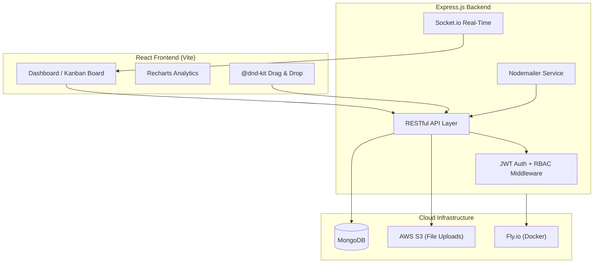
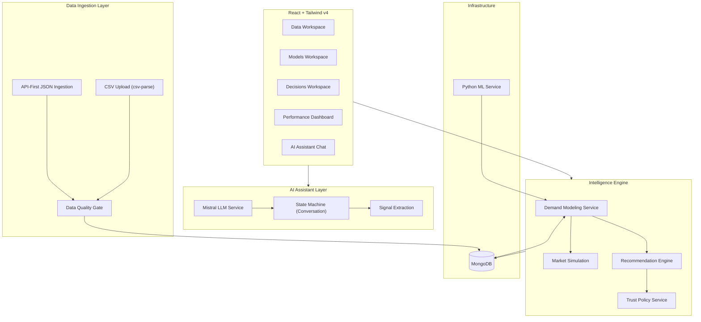

# 🎯 Internship Review PPT — Complete Preparation Guide

> **Pranay Kumar | A149 | Tech Biz Solution | B.Tech CE, NMIMS STME**
> Presentation to: **Internal Mentor** (Dr. Preeti Gupta) + **External Mentor** (Industry)

---

## 📊 Scoring Rubric Mapping

Your PPT will be evaluated on **6 parameters**. Here's how each slide maps to them:

| Parameter | Weight | Which Slides Cover It |
|---|---|---|
| **Structure & Flow** | ⭐⭐⭐ | Overall deck narrative — Phase progression, consistent templates |
| **Communication Clarity** | ⭐⭐⭐ | Bullet brevity, visual-first slides, no text walls |
| **Slide Quality** | ⭐⭐⭐ | Design, diagrams, icons, consistent color palette |
| **Confidence** | ⭐⭐ | Your delivery — rehearse the "why" behind each decision |
| **Time Management** | ⭐⭐ | 15-20 min target, scripted transitions |
| **Architecture/Workflow Explanation** | ⭐⭐⭐⭐ | System diagrams for each project — this is where you WIN or LOSE |

---

## 🏗️ Recommended Slide Structure (18-22 slides, 15-20 min)

### Section 1: Opening (2 slides, ~1.5 min)

#### Slide 1 — Title Slide
```
Pranay Kumar | A149 | 70022200357
B.Tech CE, SVKM's NMIMS STME

Internship at Tech Biz Solution, Jodhpur
Jan 2025 – May 2026

Faculty Mentor: Dr. Preeti Gupta
Industry Mentor: Mr. Kanwar Pal Singh
```
- Clean, professional layout
- Company logo + college logo
- Dark background with accent color

#### Slide 2 — Agenda / Roadmap
```
Visual timeline showing 4 phases:
Phase 1: Foundation & Training (2 weeks)
Phase 2: TaskOps — Independent Full-Stack App (5 weeks)
Phase 3: NewsTV19 — Company Product Contribution (5 weeks)
Phase 4: Revora — Business Intelligence Platform (6+ weeks, ongoing)
```
- Use a **horizontal timeline graphic** — NOT a bullet list
- Color-code each phase (Slate → Blue → Emerald → Rose — same as your Gantt chart)

> [!TIP]
> This is the slide that sets "Structure & Flow" in the evaluator's mind. Make it visual and memorable.

---

### Section 2: Context (2 slides, ~1.5 min)

#### Slide 3 — Company Profile
```
Tech Biz Solution | Jodhpur, Rajasthan
• IT Services & Consulting | 51-200 employees | Est. 2011
• Core: Digital Transformation, Custom Software, AI & Automation
• Tech Stack: MERN, AWS, Tailwind, Docker
• Certifications: ISO 9001, ISO 27001, GDPR
```
- Keep this BRIEF — 4-5 bullet points max
- Use company logo prominently
- Optional: 1-line about your team (Software Development Team, Full-Stack role)

#### Slide 4 — Internship Objectives (What was I supposed to learn?)
```
1. Master full-stack MERN development
2. Build & deploy a production-ready application independently
3. Contribute to an active company product codebase
4. Implement industry-standard security, real-time, & cloud practices
5. Develop a data-driven business intelligence platform
```
- Use **icon + one-liner** format (5 items max)
- This sets expectations for what follows

---

### Section 3: Project Deep-Dives (10-12 slides, ~12 min)

> [!IMPORTANT]
> This is the **CORE** of your presentation. Spend ~3 min per project. Each project needs:
> 1. **What it is** (1 slide)
> 2. **Architecture diagram** (1 slide)  
> 3. **Key technical highlight** (1 slide, optional for Phase 1)

---

#### 🔵 Phase 1: Foundation (1 slide, ~1 min)

#### Slide 5 — Backend Fundamentals Training
```
Duration: Jan 5 – Jan 18, 2025 (2 weeks)
Skills Acquired:
• Node.js runtime, event loop, async/await
• Express.js — RESTful API design, middleware pipeline
• MongoDB + Mongoose — schema design, CRUD, validation
• JWT authentication — token-based auth, protected routes
• Environment management — dotenv configuration
```
- Use a **skill progression visual** (stacked blocks or skill tree)
- Keep it to 1 slide — this is setup, not the main act

---

#### 🔵 Phase 2: TaskOps (3 slides, ~3.5 min)

#### Slide 6 — TaskOps Overview
```
TaskOps — Enterprise Task Management Platform
• Full-stack MERN application, built independently
• 3-tier RBAC: Admin → Sub-Admin → Employee
• Real-time collaboration via WebSocket (Socket.io)
• Kanban board with drag-and-drop (@dnd-kit)
• Cloud deployment: Docker → Fly.io
```
- Include a **screenshot** of the TaskOps dashboard (if available)
- Highlight "independently built" — this impresses mentors

#### Slide 7 — TaskOps Architecture Diagram ⭐⭐⭐

- **THIS SLIDE IS CRITICAL** — evaluators specifically check architecture explanation ability
- Practice explaining data flow: User → Frontend → API → Auth Middleware → DB → Response

#### Slide 8 — TaskOps Key Innovation
```
Challenge: Real-time theme sync for analytics charts
Solution: MutationObserver on data-theme attribute
→ Recharts dynamically adapts to dark/light mode

Challenge: Targeted notifications across roles
Solution: Socket.io rooms scoped per user email
→ Only relevant users receive task updates
```
- Pick 1-2 technical challenges you solved
- **"Problem → Solution → Impact"** format
- This proves you can think critically, not just follow tutorials

---

#### 🟢 Phase 3: NewsTV19 (3 slides, ~3 min)

#### Slide 9 — NewsTV19 Overview
```
NewsTV19 — Real-Time News Aggregation Platform
• Company product contribution (first time on existing codebase)
• 20+ categories: Politics, Business, Tech, Sports, State-wise
• Multi-source RSS feeds: TOI, BBC, Economic Times, Google News
• React + TypeScript + Vite frontend
```
- Emphasize the **shift** from building from scratch → contributing to production code
- This is a soft-skill win: "I can read and extend existing codebases"

#### Slide 10 — NewsTV19 Architecture Diagram ⭐⭐⭐

```mermaid
graph LR
    subgraph Sources["RSS Feed Sources"]
        TOI[Times of India]
        BBC[BBC News]
        ET[Economic Times]
        GN[Google News]
    end

    subgraph Proxy["Express.js RSS Proxy Server"]
        Parser["rss-parser + Custom Fields"]
        Dedup["Deduplication Engine"]
        Scraper["Async OG Image Scraper"]
        Norm["Data Normalizer"]
    end

    subgraph Frontend["React + TypeScript + Vite"]
        Cat["Category Filter UI"]
        Search["Keyword Search"]
        State["State-wise News"]
        Ticker["Live News Ticker"]
    end

    Sources --> Parser
    Parser --> Dedup
    Dedup --> Norm
    Norm --> Scraper
    Scraper --> Frontend
```

- Walk through the **data pipeline**: Raw RSS → Parse → Deduplicate → Normalize → Scrape OG Images → Serve to Frontend

#### Slide 11 — NewsTV19 Key Technical Achievement
```
Problem: Inconsistent images — RSS feeds don't always include thumbnails
Solution: Built an Async OG Metadata Scraper
• Fetches og:image from original article URLs
• Uses AbortController with timeout to prevent blocking
• Graceful fallback to placeholder on failure

Result: 95%+ articles have high-quality images
```
- This shows **engineering thinking**, not just coding

---

#### 🔴 Phase 4: Revora (3-4 slides, ~4 min)

#### Slide 12 — Revora Overview
```
Revora — Dynamic Pricing & Demand Intelligence Platform
• Business intelligence system for pricing optimization
• CSV data ingestion → Quality analysis → Demand modeling
• Price simulation sandbox with "What-If" scenarios
• AI-powered pricing assistant (Mistral LLM integration)
• Best price recommendations with guardrails & confidence
```
- This is your **most complex project** — show it with pride
- Mention it's enterprise-grade: data pipelines, statistical models, AI

#### Slide 13 — Revora System Architecture ⭐⭐⭐⭐

- **This is your flagship architecture slide** — spend 60-90 seconds explaining it
- Practice the data flow: Upload CSV → Quality Gate → Store → Demand Model → Simulate → Recommend

#### Slide 14 — Revora: The Intelligence Pipeline
```
Step 1: CSV Ingestion
  → Stream-based parsing, flexible header mapping, duplicate detection

Step 2: Data Quality Assessment
  → Product readiness badges, stockout detection, missing field analysis

Step 3: Demand Modeling
  → Simple Price Response + Log-Log Elasticity + Context-Adjusted models

Step 4: Price Simulation
  → "What-If" scenarios with demand, revenue, profit prediction

Step 5: Recommendation
  → Good/Avoid price ranges, competitor adjustment, confidence scores
```
- Visual pipeline: left-to-right flow with icons
- Shows your understanding of the full business logic

#### Slide 15 — Revora: AI Pricing Assistant (Optional bonus slide)
```
• Integrated local Mistral LLM for conversational pricing guidance
• State-machine architecture for multi-turn conversations
• Signal extraction → Grounded recommendations
• Fallback to deterministic "Advisor Brain" when LLM unavailable
```
- Only include if you're confident explaining it
- This is a **differentiator** — most interns don't touch LLM integration

---

### Section 4: Learning & Impact (3 slides, ~2.5 min)

#### Slide 16 — Technical Skills Acquired
```
Use a VISUAL SKILLS MATRIX or TECH RADAR, not bullet points!

Backend:     Node.js | Express.js | MongoDB | Mongoose
Frontend:    React | TypeScript | Vite | Tailwind CSS v4
Real-Time:   Socket.io | WebSocket protocols
Cloud/DevOps: Docker | Fly.io | AWS S3
Security:    JWT | RBAC | bcrypt | 2FA
Data:        CSV pipelines | RSS parsing | OG scraping
AI/ML:       Mistral LLM | Statistical demand models
```
- Use a **grid/radar chart** visual — NOT a text list
- Group by category with color coding

#### Slide 17 — Professional Growth
```
• Independent project delivery (TaskOps: design → deploy)
• Production codebase navigation & contribution (NewsTV19)
• Agile development with iterative feature delivery
• Debugging complex full-stack issues across layers
• Version control workflows (Git branching, PRs)
```
- Keep this to 4-5 points
- Tie each point to a SPECIFIC project experience

#### Slide 18 — Challenges & Solutions Summary
```
| Challenge | Project | Solution |
|-----------|---------|----------|
| Real-time theme sync | TaskOps | MutationObserver pattern |
| Missing article images | NewsTV19 | Async OG Metadata Scraper |
| Processing 1000+ CSV rows | Revora | Stream-based csv-parse |
| LLM conversation loops | Revora | Deterministic state machine |
```
- This shows **problem-solving ability**
- Evaluators LOVE this format

---

### Section 5: Closing (2 slides, ~1.5 min)

#### Slide 19 — Future Work & Roadmap
```
Revora:
  → Predictive demand forecasting (time-series)
  → Real-time competitor tracking
  → Redis caching for analytics performance
  → Production deployment

General:
  → CI/CD pipeline (GitHub Actions)
  → Automated testing (Jest, Supertest)
  → Microservices architecture exploration
```
- Shows forward thinking — you're not just completing tasks
- Keep it concise — 3-4 items max

#### Slide 20 — Thank You + Q&A
```
Thank You!
Pranay Kumar | A149

Projects: TaskOps | NewsTV19 | Revora
Stack: MERN | TypeScript | Docker | AWS | Mistral AI

Open for Questions
```
- Include QR code linking to live demo or GitHub (if available)
- Keep the demo URLs or screenshots handy for Q&A

---

## 🤖 How to Build This Entirely Using AI

### Step-by-Step AI Workflow

#### Step 1: Generate the PPT Structure
**Tool: ChatGPT / Claude / Gemini**
```
Prompt: "Create a 20-slide PPT outline for an internship review 
presentation. I worked on 4 projects: Backend Training, TaskOps 
(MERN task management), NewsTV19 (news aggregation), Revora 
(dynamic pricing intelligence). Include architecture slides."
```

#### Step 2: Create the Actual Slides
**Tool: [Gamma.app](https://gamma.app)** (Best for AI-generated presentations)
```
Steps:
1. Go to gamma.app → "Create new" → "Presentation"
2. Paste your outline or topic description
3. Select a professional dark theme
4. Gamma will auto-generate slides with layout, icons, and structure
5. Edit each slide to match your content
```

> [!TIP]
> **Gamma.app** is the #1 recommendation for AI-generated PPTs. It creates beautiful, professional slides instantly. Free tier gives you 10 credits.

**Alternative Tools:**
- **[SlidesAI.io](https://slidesai.io)** — Google Slides plugin, generates from text
- **[Beautiful.ai](https://beautiful.ai)** — Smart templates, auto-layout
- **[Tome](https://tome.app)** — Narrative-style AI presentations
- **[Canva AI](https://canva.com)** — "Magic Design" for presentations

#### Step 3: Generate Architecture Diagrams
**Tool: ChatGPT → Mermaid.js → [Mermaid Live Editor](https://mermaid.live)**
```
Steps:
1. Ask ChatGPT: "Generate a Mermaid.js diagram for [project architecture]"
2. Copy the Mermaid code
3. Go to mermaid.live → paste → download as PNG/SVG
4. Insert into your PPT
```

**Alternative: [Eraser.io](https://eraser.io)**
```
Steps:
1. Describe your architecture in plain English
2. Eraser generates a professional diagram
3. Export and insert into PPT
```

**Alternative: [Excalidraw with AI](https://excalidraw.com)**
- Sketch-style diagrams that look unique and memorable

#### Step 4: Generate Screenshots/Mockups
**If you have live apps running:**
```
1. Take screenshots of each project's key pages
2. Use Canva or Figma to frame them in device mockups
3. AI tool: shots.so or mockuphone.com for device frames
```

**If apps aren't running:**
- Use the screenshots you already have (e.g., `Screenshot_16-4-2026_143025_localhost.jpeg` in TaskOps)
- Generate UI mockups using AI image generation

#### Step 5: Create the Gantt Chart
**You already have `gantt.py`!**
```
Just run: python gantt.py
Use the generated gantt_chart.png in your PPT
```

#### Step 6: Polish with AI
**Tool: ChatGPT / Claude**
```
Prompt: "Rewrite these bullet points to be concise, impactful, 
and suitable for a PPT slide. Max 6 words per point."
```

#### Step 7: Generate Speaker Notes
**Tool: ChatGPT**
```
Prompt: "Write speaker notes for a PPT slide about [topic]. 
The audience is college professors and industry mentors. 
Keep it conversational, 30-45 seconds of speaking time."
```

---

## 🎤 Presentation Delivery Tips

### Time Management Plan (20 minutes total)

| Section | Slides | Time | Pacing |
|---------|--------|------|--------|
| Opening + Agenda | 1-2 | 1.5 min | Quick, confident |
| Company + Objectives | 3-4 | 1.5 min | Professional, brief |
| Phase 1: Foundation | 5 | 1 min | Summarize quickly |
| Phase 2: TaskOps | 6-8 | 3.5 min | **Slow down on architecture** |
| Phase 3: NewsTV19 | 9-11 | 3 min | Emphasize codebase contribution |
| Phase 4: Revora | 12-15 | 4 min | **Your strongest section** |
| Skills + Challenges | 16-18 | 2.5 min | Reflective, honest |
| Future + Q&A | 19-20 | 3 min | Forward-looking, open |

### Confidence Boosters

1. **Practice the architecture slides 5x each** — these are where you prove depth
2. **Anticipate questions:**
   - "Why did you choose MongoDB over PostgreSQL?"
   - "How does the real-time notification system work?"
   - "Explain the demand modeling approach in Revora"
   - "What was the biggest challenge you faced?"
   - "How would you scale this system?"
3. **Use the "Explain like I'm five" test** — if you can explain Socket.io rooms or OG scraping simply, you've mastered it
4. **Don't memorize scripts** — memorize **key phrases** and transitions:
   - "The interesting technical challenge here was..."
   - "This phase taught me that production code is fundamentally different from..."
   - "The architecture choice was driven by..."

### Communication Clarity Rules

- ✅ **1 idea per slide** — no text walls
- ✅ **6x6 rule** — max 6 bullets, max 6 words each
- ✅ **Diagrams > Text** — always prefer visual explanation
- ✅ **"So what?"** — after every slide, the audience should know WHY it matters
- ❌ **Don't read from slides** — slides are VISUAL ANCHORS, not scripts
- ❌ **Don't over-explain Phase 1** — it's training, not your achievement

---

## 🎨 Design Guidelines

### Color Palette (match your Gantt chart)
```
Foundation:  #94a3b8 (Slate)
TaskOps:     #3b82f6 (Blue)
NewsTV19:    #10b981 (Emerald)
Revora:      #f43f5e (Rose)
Background:  #0f172a (Dark Navy) or #ffffff (White)
Text:        #f8fafc (Light) or #1e293b (Dark)
```

### Font Recommendations
- **Headings:** Inter, Outfit, or Poppins (Bold)
- **Body:** Inter or Roboto (Regular)
- **Code snippets:** JetBrains Mono or Fira Code

### Slide Design Rules
1. Use **consistent margins and alignment**
2. **Dark theme** preferred for tech presentations
3. **Icon library:** Use Lucide, Heroicons, or FontAwesome icons
4. **No clipart or stock photos** — use actual screenshots, diagrams, and code snippets

---

## ⚡ Quick-Start Checklist

- [ ] Run `python gantt.py` to generate your timeline chart
- [ ] Take screenshots of TaskOps, NewsTV19, and Revora dashboards
- [ ] Go to **gamma.app** → create presentation with this outline
- [ ] Generate architecture diagrams at **mermaid.live** using the Mermaid code above
- [ ] Write speaker notes using ChatGPT (30-45 sec per slide)
- [ ] Practice full run-through 3 times (aim for 18 minutes)
- [ ] Prepare 5 likely Q&A answers
- [ ] Test slide transitions and animations
- [ ] Keep a backup PDF version on your phone

> [!CAUTION]
> **Do NOT exceed 22 slides.** More slides = more rushing = less confidence. Quality > Quantity.

---

## 🔗 AI Tools Summary

| Purpose | Best Tool | Alternative |
|---------|-----------|-------------|
| **Generate PPT** | [Gamma.app](https://gamma.app) | Beautiful.ai, Tome, SlidesAI |
| **Architecture Diagrams** | [Mermaid Live](https://mermaid.live) | Eraser.io, Excalidraw |
| **Write Content** | ChatGPT / Claude | Gemini |
| **Speaker Notes** | ChatGPT | Claude |
| **Design Polish** | Canva AI | Figma |
| **Device Mockups** | shots.so | mockuphone.com |
| **Gantt Chart** | Your `gantt.py` | ChartGPT, Mermaid Gantt |
| **Practice/Rehearse** | Record on phone | Otter.ai for transcript |
